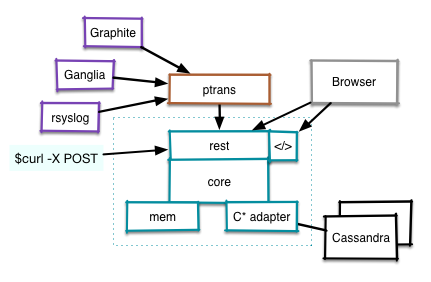

= rhq-metrics
:source-language: java

ifdef::env-github[]
[link=https://travis-ci.org/rhq-project/rhq-metrics]
image::https://travis-ci.org/rhq-project/rhq-metrics.svg?branch=master[Build Status,70,18]
endif::[]

= Project to implement a MaaS and ChaaS

* MaaS: Metrics as a Service
* ChaaS: Charts as a Service

== Quickstart

To get a first impression you can also run the quickstart via

  ./start.sh

in the root directory. This will build and start RHQ-metrics with the memory backend. After starting you can
 navigate to http://localhost:8080/[http://localhost:8080/] to a (temporary) UI that uses the service and comes
 pre-populated with some dummy data.

By modifying the start parameter in the script you can also use the (already running) Cassandra backend - see below.

== Build Instructions

This project has a dependency on Cassandra 2.x. A running Cassandra cluster, which can be a single node, is required
for unit and integration tests.

TIP: If you only want to build the sources without a running C* cluster, you can run `mvn install -DskipTests`.
Building without C* also means that no schema updates are applied.

== Setting up Cassandra

1. Install https://github.com/pcmanus/ccm[ccm].
  a. Review its build/install instructions for python package dependencies that need to be installed, namely six and pyYaml.
2. `ccm create -v 2.0.7 rhq`
3. `ccm populate -n 1`
4. `ccm start`
5. `mvn install`

These steps build and install a single node cluster of Cassandra 2.0.7. Any version of 2.x should suffice if you prefer
a different one. Note that while it is recommended to use ccm, it is not necessary. You just need to make sure
you have a running 2.x cluster.

=== Installing ccm

ccm is a python module that has a dependencies on several other python modules.

= Import data from Ganglia

If you have Ganglia `gmond` running, you can import its data by running the pTrans client:

----
cd clients/ptranslator
sh start.sh
----

For this to work, the packets from Ganglia need to have a large enough TTL to be seen on the host where you run pTrans.

# Forums, hacking, irc

Visit the https://community.jboss.org/en/rhq/rhq-metrics[Forums] to discuss RHQ-metrics.

We love contributions and pull-requests :-)

To meet the guys, join us on irc://irc.freenode.net/#rhq[Freenode IRC]
