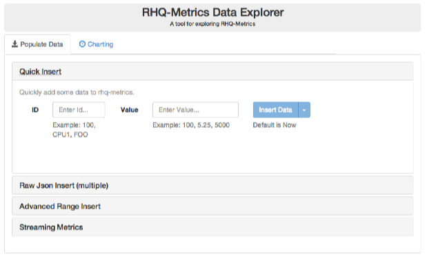

# RHQ-Metrics Console

## What does it do?
The UI provides an easy UI way of :
1. Inserting/creating  data in various ways

2. Viewing the data in the database both visually via a graph and a grid table

## Purpose
This UI is a stripped down version of the forthcoming  metrics UI that will provide dashboards and insights into metric data patterns. This data explorer allows to easily insert and view data put into the rhq-metric datastore. The focus on simplicity provides an example to easily incorporate the angular directives into other applications without the complexity of a full blown management UI
(and understanding its many accompanying libraries). Although stripped down, it is still very functional at populating a datastore and viewing its results graphically as well as a learning tool for working with the *rhq-metrics*.

_NOTE: The graphical chart components used here will be the same ones used in other more advanced scenarios._

## Install
The standard **mvn install** will build the war artifact in 'console/target/metrics-console-*.war'. Place this along with the 'rest-servlet/target/rest-servlet-*.war' in your app server deployments directory to have a functioning frontend/backend.
Browse [http://127.0.0.1:8080/](http://127.0.0.1:8080/) and explore...

## Dev Install (optional)
This is an optional development install for a standard [Grunt](http://gruntjs.com) project.
Grunt is a build tool for javscript webapps just like maven is for java. The build capabilities of grunt are not used here as we are using maven for building/deploying. Grunt is used here for starting a development environment that automatically refreshes itself whenever html, css or javascript files change. Making a fast/agile environment for web development.

0. Go to proper directory **'cd console/src/main/webapp'**
1. Install [Node.js](http://nodejs.org)  (and npm) if not already installed
2. Install the node packages: **'npm install -g grunt-cli bower karma'**
(if you get an EACESS permission errors you may need to use sudo to the do the install)
3. Install npm packages for tooling: **'npm install'**
4. Optional: Install [Bower](http://bower.io) packages for UI: **'bower install'**
5. Start the [Grunt](http://gruntjs.com) Server: **'grunt serve --force'**
6. Browse [http://127.0.0.1:9000/](http://127.0.0.1:9000/) and explore...

Grunt will automatically launch a url for you in your browser and will reload any changes in real time to the browser. Feel Free to play around.

Tip: Make sure that you have a rest backend running so that the UI console can connect to something. 

1. **'cd rest-servlet'**
2. **'mvn wildfly:run'**

## Javascript API documentation

. To generate the jsdoc documentation for the project: **'grunt ngdocs'**

. To view documentation run **'grunt ngdocs:view'** and peruse documentation at [http://localhost:8000/](http://localhost:8000/)

## More Resources
1. Check out the RHQ charts documentation which is what the charting component is originally based on: [RHQ Charts](https://docs.jboss.org/author/display/RHQ/d3+Charts)
