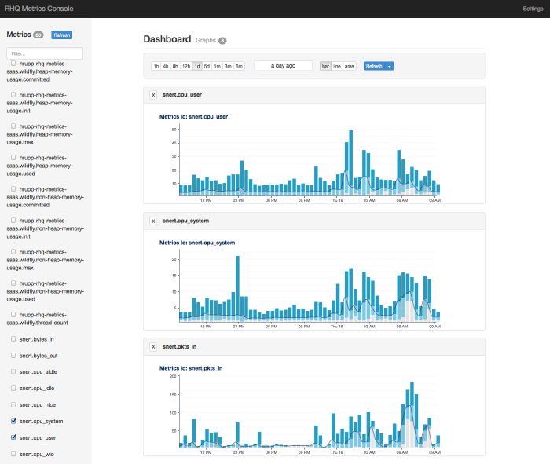

= RHQ-Metrics Console (and UI Components)

== Quickstart

RHQ Metrics Dashboard Console:

== Why?
To start using the rhq-metrics project in my own work. How to start?
The console is a quick and easy way to view the rhq-metrics datastore (either in-Memory or Cassandra).
The console is very usable but is really just intended as a technical preview of what you can do with RHQ-metrics and it's AngularJS UI components.
The UI components serve as high level building blocks to create your own projects more quickly and with additional capability that will continue to be added into the future.

== Purpose
This console showcases the capabilities of rhq-metrics and it's charting UI components used to visualize the metric data in meaningful ways.

The visual UI https://angularjs.org/[Angular.js] components provided by the rhq-metrics project are the primary deliverable of the console/UI module and are intended to be plug-n-play components for quickly creating dashboards for the rhq-metrics backend.

The Angular.js components will be published as http://bower.io[Bower] packaged components(think maven repo) and published to the bower repository to be easily installed and consumed in other javascript applications.

== Install
The standard **mvn install** will build the war artifact in 'console/target/metrics-console-*.war'. Place this along with the 'rest-servlet/target/rest-servlet-*.war' in your app server deployments directory to have a functioning frontend/backend.
Browse http://127.0.0.1:8080/[http://127.0.0.1:8080] and play...

== Dev Install (optional)
This is an optional development install for a standard http://gruntjs.com[Grunt] project.
Grunt is a build tool for javascript webapps just like maven is for java. The build capabilities of grunt are not used here as we are using maven for building/deploying. Grunt is used here for starting a development environment that automatically refreshes itself whenever html, css or javascript files change. Making a fast/agile environment for web development.

0. Go to proper directory **'cd console/src/main/webapp'**
1. Install http://nodejs.org[Node.js]  (and npm) if not already installed
2. Install the node packages: **'npm install -g grunt-cli bower karma'**
(if you get an EACESS permission errors you may need to use sudo to the do the install) These commands are installed globally because they are are run from the command line.
3. Install local npm packages for tooling: **'npm install'**
4. Optional: Install http://bower.io[Bower] packages for UI: **'bower install'**
5. Start the http://gruntjs.com[Grunt] Server: **'grunt serve'**
6. Browse http://127.0.0.1:9000/[http://127.0.0.1:9000/] and explore...

Grunt will automatically launch a url for you in your browser and will reload any changes in real time to the browser. Feel Free to play around.

Tip: Make sure that you have a rest backend running so that the UI console can connect to something.

1. **'cd rest-servlet'**
2. **'mvn wildfly:run'**

== More Resources
1. Check out the RHQ charts documentation which is what the charting component is originally based on: https://docs.jboss.org/author/display/RHQ/d3+Charts[RHQ Charts]
2. The charting functionality is based on the http://d3js.org[d3] javascipt library. Examples shown https://github.com/mbostock/d3/wiki/Gallery[here]

