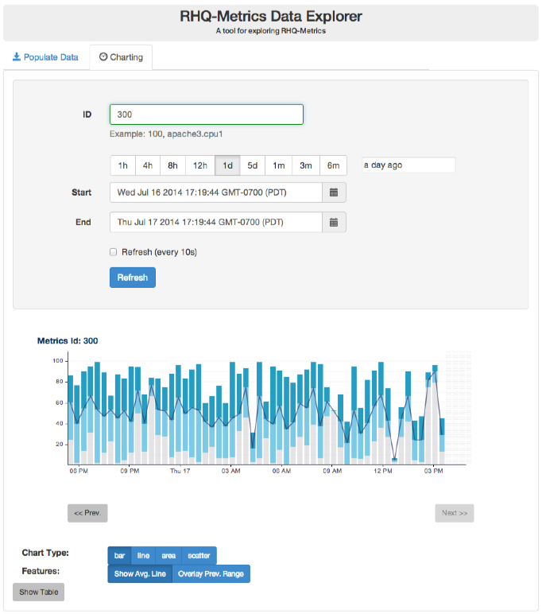

# RHQ-Metrics Console (and UI Components)

## Quickstart
Show me what the UI Console does: [RHQ-Metrics UI Quickstart Video](https://vimeo.com/101576357)   _Length - 8:33_

## Why?
I want to start using the rhq-metrics project in my own work. How do I start?
The console is a quick and easy way to populate and view the rhq-metrics datastore (either in-Memory or Cassandra).
Less intended as a console, but more as a component provider to your own projects. The UI components serve as high level
building blocks to create your own projects more quickly and with additional capability that continue to be added into the future.

## What does it do?
The console provides a simple UI for:
1. Inserting/creating  data in various ways

2. Viewing the data in the database both visually via a graph and a grid table

3. An example of the capabilities of rhq-metrics and the Angular.js charting components.

## Purpose
This console showcases the capabilities of rhq-metrics and the complementary UI components used to visualize the metric data in meaningful ways.

The console is very functional at populating a datastore and viewing its results graphically as well as a learning tool for working with the *rhq-metrics* suite.

The visual UI [Angular.js](https://angularjs.org/) components provided by the rhq-metrics project are the primary deliverable of the console/UI module and are intended to be plug-n-play components for quickly creating dashboards for the rhq-metrics backend.

The Angular.js components will be published as [bower](http://bower.io) packaged components(think maven repo) and published to the bower repository to be easily installed and consumed in other javascript applications.

## Install
The standard **mvn install** will build the war artifact in 'console/target/metrics-console-*.war'. Place this along with the 'rest-servlet/target/rest-servlet-*.war' in your app server deployments directory to have a functioning frontend/backend.
Browse [http://127.0.0.1:8080/](http://127.0.0.1:8080/) and explore...

## Dev Install (optional)
This is an optional development install for a standard [Grunt](http://gruntjs.com) project.
Grunt is a build tool for javscript webapps just like maven is for java. The build capabilities of grunt are not used here as we are using maven for building/deploying. Grunt is used here for starting a development environment that automatically refreshes itself whenever html, css or javascript files change. Making a fast/agile environment for web development.

0. Go to proper directory **'cd console/src/main/webapp'**
1. Install [Node.js](http://nodejs.org)  (and npm) if not already installed
2. Install the node packages: **'npm install -g grunt-cli bower karma'**
(if you get an EACESS permission errors you may need to use sudo to the do the install) These commands are installed globally because they are are run from the command line.
3. Install local npm packages for tooling: **'npm install'**
4. Optional: Install [Bower](http://bower.io) packages for UI: **'bower install'**
5. Start the [Grunt](http://gruntjs.com) Server: **'grunt serve'**
6. Browse [http://127.0.0.1:9000/](http://127.0.0.1:9000/) and explore...

Grunt will automatically launch a url for you in your browser and will reload any changes in real time to the browser. Feel Free to play around.

Tip: Make sure that you have a rest backend running so that the UI console can connect to something. 

1. **'cd rest-servlet'**
2. **'mvn wildfly:run'**

## More Resources
1. Check out the RHQ charts documentation which is what the charting component is originally based on: [RHQ Charts](https://docs.jboss.org/author/display/RHQ/d3+Charts)
2. The charting functionality is based on the [d3](http://d3js.org) javascipt library. Examples shown [here](https://github.com/mbostock/d3/wiki/Gallery)

_Note: this project is very active so expect rapid changes_
